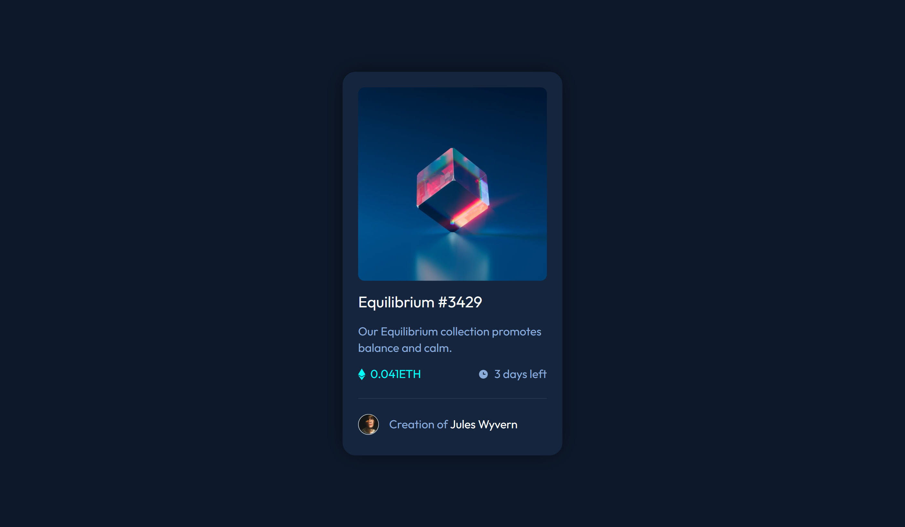
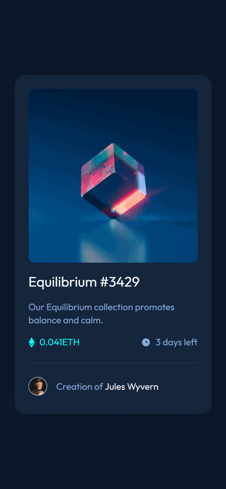

# Frontend Mentor - NFT preview card component solution

This is a solution to the [NFT preview card component challenge on Frontend Mentor](https://www.frontendmentor.io/challenges/nft-preview-card-component-SbdUL_w0U). Frontend Mentor challenges help you improve your coding skills by building realistic projects.

## Table of contents

-   [Overview](#overview)
    -   [The challenge](#the-challenge)
    -   [Screenshot](#screenshot)
    -   [Links](#links)
-   [My process](#my-process)
    -   [Built with](#built-with)
    -   [Continued development](#continued-development)
    -   [Useful resources](#useful-resources)
-   [Author](#author)

**Note: Delete this note and update the table of contents based on what sections you keep.**

## Overview

### The challenge

Users should be able to:

-   View the optimal layout depending on their device's screen size
-   See hover states for interactive elements

### Screenshot

### Links

-   Solution URL: [Add solution URL here](https://your-solution-url.com)
-   Live Site URL: [Add live site URL here](https://your-live-site-url.com)

## My process

### Built with

-   Semantic HTML5 markup
-   SASS/SCSS
-   Flexbox
-   [React](https://reactjs.org/) - JS library
-   [CRA](https://create-react-app.dev/) - React framework

### Continued development

I find it beginner friendly to use the create react app although I some people says taht CRA has so much cons I find it great to start with as a beginner. I will continue to learn how to make components and eventually use hooks and other features of react for future projects.

### Useful resources

-   (https://youtu.be/j942wKiXFu8) - I used this youtube playlist from The Net Ninja as a guide on learning React.
-   (https://github.com/gitname/react-gh-pages) - As for deployment on github pages this repo helped me to do it.

## Author

-   Frontend Mentor - [@yourusername](https://www.frontendmentor.io/profile/yourusername)
-   Twitter - [@yourusername](https://www.twitter.com/yourusername)
